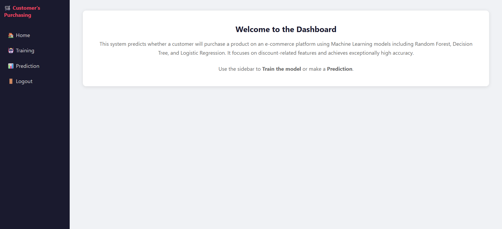
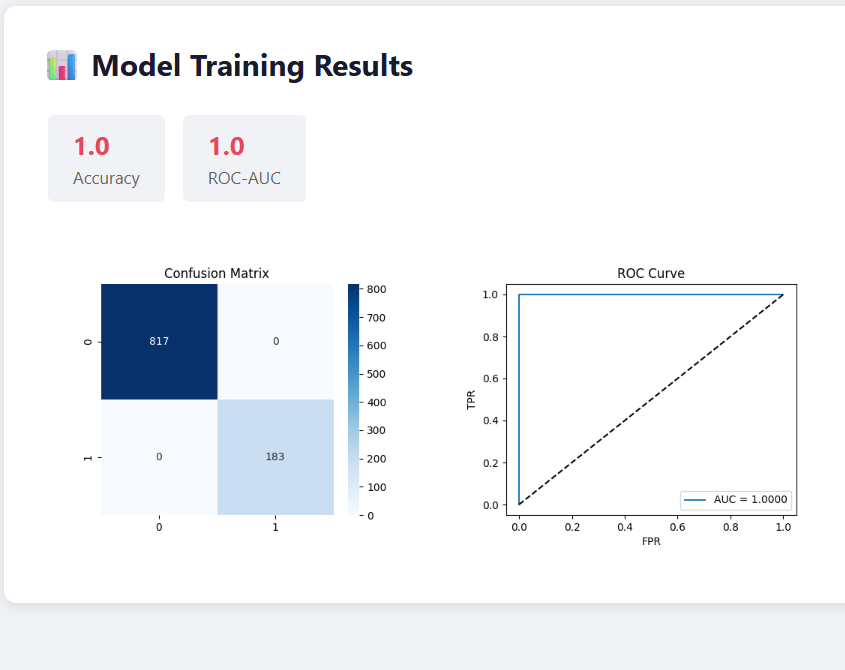
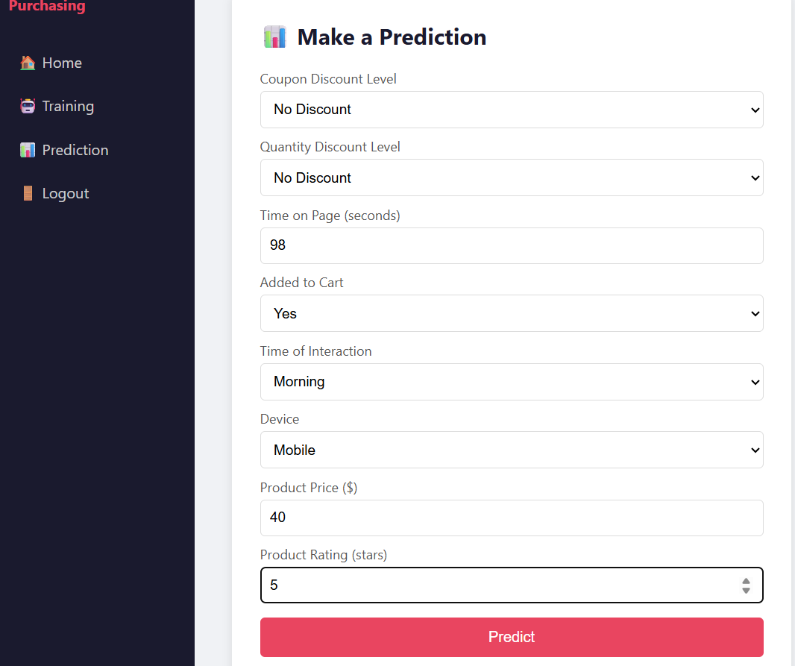
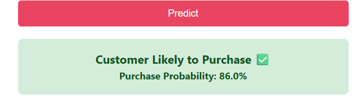

# 🛒 Customer Purchase Decision Prediction — ML Web App

A full-stack machine learning web application that predicts whether a customer will purchase a product on an e-commerce platform (JD.com dataset).

## 🚀 Key Results
| Metric | Score |
|--------|-------|
| Accuracy | **99.45%** |
| ROC-AUC | **0.9998** |
| Dataset Size | 7M+ records |
| Top Feature Impact | >50% (discount levels) |
## 📸 Screenshots

### 🏠 Home Dashboard





### 📊 Model Training Results





### 🎯 Prediction Page





### ✅ Prediction Result



## 🛠 Tech Stack
- **Backend:** Python, Django
- **ML:** scikit-learn, Random Forest, Decision Tree, Logistic Regression
- **Data:** Pandas, NumPy
- **Visualization:** Matplotlib, Seaborn
- **Database:** SQLite

## 📋 Features
- User registration & login system
- Admin dashboard to manage users
- Model training with live metrics (Accuracy, ROC-AUC, Confusion Matrix)
- Real-time purchase prediction from user input
- Feature importance analysis

## ⚙️ Setup & Run

```bash
# 1. Clone the repo
git clone https://github.com/sanaishrath7860-dotcom/customer-purchase-prediction.git
cd customer-purchase-prediction

# 2. Install dependencies
pip install -r requirements.txt

# 3. Run migrations
python manage.py makemigrations
python manage.py migrate

# 4. Start the server
python manage.py runserver
```

Then open `http://127.0.0.1:8000` in your browser.

**Admin login:** ID: `admin` | Password: `admin123`

## 📁 Project Structure
```
customer-purchase-prediction/
├── manage.py
├── requirements.txt
├── myproject/          # Django project settings
├── myapp/              # Main application
│   ├── models.py       # User model
│   ├── views.py        # All views including ML logic
│   ├── urls.py
│   └── templates/      # HTML templates
└── static/             # Generated plots
```

## 🔍 How It Works
1. Data is loaded and preprocessed (label encoding, feature engineering)
2. Random Forest classifier is trained on e-commerce transaction features
3. Users input product/discount features via a web form
4. The trained model returns a purchase probability score in real time

## 📊 Key Finding
Discount-related features (coupon discount level and quantity discount level) contribute **over 50%** of the model's predictive power, highlighting the critical role of pricing strategies in purchase decisions.
